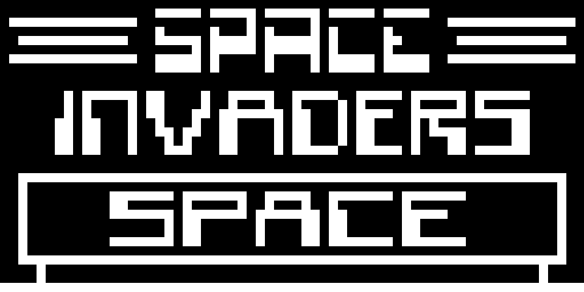

# Rust Chip-8 Emulator

<p align="center">
  
</p>

[](#) [](#)

A modern Chip-8 emulator written in Rust, designed to offer an authentic retro gaming experience with enhanced features like near 60fps frame rate and sound support. This project follows the comprehensive guide "An Introduction to Chip-8 Emulation using the Rust Programming Language" by aquova, extending its foundations with significant improvements and functionalities.

## About Chip-8

Chip-8 is an interpreted programming language developed in the mid-1970s for use on microcomputers and calculators. It was designed to allow video games to be more easily programmed for these computing devices. Chip-8 programs are run on a Chip-8 virtual machine. It's known for its simplicity, making it an excellent subject for those interested in understanding the basics of emulators and how they work.

### Key Features of Chip-8:

- 16 8-bit data registers named V0 to VF.
- 4K memory.
- Monochrome (black and white) graphics, with a resolution of 64x32 pixels.
- 16 keys hexadecimal keypad.
- Sound and delay timers.

## Project Features

- **Authentic Emulation**: Accurately emulates the Chip-8 instruction set and behavior.
- **High Performance**: Achieves near 60 frames per second for a smooth gameplay experience.
- **Sound Support**: Implements buzzer sound emulation to enhance game immersion.
- **Cross-Platform**: Designed to run on multiple operating systems, thanks to Rust's versatility.

## Getting Started

To get started with this Chip-8 emulator, you will need to have Rust installed on your system. Additionally, this emulator uses SDL2 for rendering and input handling, so you'll need to install the SDL2 bindings for Rust. The bindings can be found at [rust-sdl2](https://github.com/Rust-SDL2/rust-sdl2).

```bash
# Clone the repository
git clone https://github.com/peterhttps/Chip-8-Emulator
# Navigate into the project directory
cd Chip-8-Emulator
# Navigate into the desktop build
cd desktop
# Build the project
cargo build --release
# Run the emulator with a game
cargo run --release path/to/game
```

## Implemented Opcodes

This emulator supports a comprehensive set of Chip-8 opcodes, enabling it to run a wide range of Chip-8 programs and games. Below is a summary of the implemented opcodes and their corresponding actions:

- `0x00E0`: Clears the screen.
- `0x00EE`: Returns from a subroutine.
- `0x1NNN`: Jumps to address NNN.
- `0x2NNN`: Calls subroutine at NNN.
- `0x3XNN`: Skips the next instruction if VX equals NN.
- `0x4XNN`: Skips the next instruction if VX doesn't equal NN.
- `0x5XY0`: Skips the next instruction if VX equals VY.
- `0x6XNN`: Sets VX to NN.
- `0x7XNN`: Adds NN to VX (carry flag is not changed).
- `0x8XY0`: Sets VX to the value of VY.
- `0x8XY1`: Sets VX to VX OR VY.
- `0x8XY2`: Sets VX to VX AND VY.
- `0x8XY3`: Sets VX to VX XOR VY.
- `0x8XY4`: Adds VY to VX. VF is set to 1 when there's a carry, and to 0 when there isn't.
- `0x8XY5`: VY is subtracted from VX. VF is set to 0 when there's a borrow, and 1 when there isn't.
- `0x8XY6`: Shifts VX right by one. VF is set to the value of the least significant bit of VX before the shift.
- `0x8XY7`: Sets VX to VY minus VX. VF is set to 0 when there's a borrow, and 1 when there isn't.
- `0x8XYE`: Shifts VX left by one. VF is set to the value of the most significant bit of VX before the shift.
- `0x9XY0`: Skips the next instruction if VX doesn't equal VY.
- `0xANNN`: Sets I to the address NNN.
- `0xBNNN`: Jumps to the address NNN plus V0.
- `0xCXNN`: Sets VX to the result of a bitwise AND operation on a random number and NN.
- `0xDXYN`: Draws a sprite at coordinate (VX, VY) that has a width of 8 pixels and a height of N pixels. Each row of 8 pixels is read as bit-coded starting from memory location I; I value doesn’t change after the execution of this instruction. VF is set to 1 if any screen pixels are flipped from set to unset when the sprite is drawn, and to 0 if that doesn’t happen.
- `0xEX9E`: Skips the next instruction if the key stored in VX is pressed.
- `0xEXA1`: Skips the next instruction if the key stored in VX isn't pressed.
- `0xFX07`: Sets VX to the value of the delay timer.
- `0xFX0A`: A key press is awaited, and then stored in VX. (Blocking Operation. All instruction halted until next key event)
- `0xFX15`: Sets the delay timer to VX.
- `0xFX18`: Sets the sound timer to VX.
- `0xFX1E`: Adds VX to I. VF is not affected.
- `0xFX29`: Sets I to the location of the sprite for the character in VX. Characters 0-F (in hexadecimal) are represented by a 4x5 font.
- `0xFX33`: Stores the binary-coded decimal representation of VX, with the most significant of three digits at the address in I, the middle digit at I plus 1, and the least significant digit at I plus 2. (The interpreter takes the decimal value of VX, and places the hundreds digit in memory at location in I, the tens digit at location I+1, and the ones digit at location I+2.)
- `0xFX55`: Stores V0 to VX (including VX) in memory starting at address I. The offset from I is increased by 1 for each value written, but I itself is left unmodified.
- `0xFX65`: Fills V0 to VX (including VX) with values from memory starting at address I. The offset from I is increased by 1 for each value


## Acknowledgments

This project would not have been possible without the comprehensive guide "An Introduction to Chip-8 Emulation using the Rust Programming Language" by aquova. Their work laid the foundation for this emulator and provided invaluable insights into the emulation of Chip-8 systems.

Special thanks to the developers and contributors of the [Rust-SDL2](https://github.com/Rust-SDL2/rust-sdl2) project for maintaining the SDL2 bindings for Rust, making it easier to handle graphics and input in this project.

Lastly, I'm grateful for the Rust programming community's support and resources, which have been indispensable throughout the development of this emulator.

## License

This project is licensed under the MIT License. This license allows you to use, share, modify, and distribute the software as long as you include the original license and copyright notice in your copies. For more detailed information, please see the [LICENSE](LICENSE) file in the repository.

The MIT License is a permissive license that is short and to the point. It lets people do anything they want with your code as long as they provide attribution back to you and don’t hold you liable.
